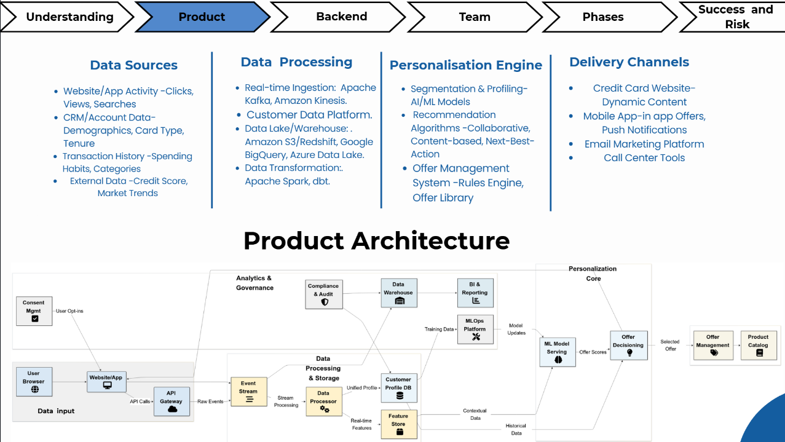

# Credit Card Personalized Marketing – Proposal

## 📌 Project Overview
This project focused on designing a **personalized marketing solution for a credit card company**. Using behavioral data provided by the company, we analyzed user spending and engagement patterns to propose a **Machine Learning (ML) model architecture** that could generate **personalized offers** for different customer segments.

The aim was to improve **customer retention, cross-sell opportunities, and overall engagement** through data-driven personalization.

---

## 🔍 What We Did
- Conducted **behavioral data analysis** on users of the credit card platform.  
- Identified key **spending habits, usage frequency, and category preferences**.  
- Proposed an **ML model architecture** for personalized marketing offers.  
- Outlined the **teams involved**, **success metrics**, and a **go-to-market (GTM) strategy**.  

---

## 🏗️ Proposed Product Architecture

  
*Figure: Conceptual architecture of the ML-powered personalized marketing engine.*

---

## 👥 Teams Involved
- **Data Science Team** – Data analysis, ML model design, feature engineering.  
- **Product Management Team** – Requirement gathering, defining business goals, GTM planning.  
- **Marketing Team** – Campaign design, customer communication, personalization strategy.  
- **Engineering Team** – Data pipelines, integration with existing credit card systems.  

---

## 📊 Key Metrics to Track
- **Customer Engagement Rate** – CTR on offers, site interactions.  
- **Conversion Rate** – Offer redemption, upsell/cross-sell adoption.  
- **Customer Retention** – Reduced churn, repeat usage.  
- **Average Revenue Per User (ARPU)** – Increase in revenue per customer.  
- **Offer Relevance Score** – Based on user satisfaction/feedback.  

---

## 🚀 Go-To-Market (GTM) Strategy
1. **Pilot Launch** – Deploy the model for a small customer base to test offer relevance.  
2. **Feedback Loop** – Collect data on engagement and refine the model.  
3. **Scaling Phase** – Extend to all customer segments with targeted personalization.  
4. **Marketing Campaigns** – Promote benefits of personalized offers to customers.  
5. **Continuous Improvement** – Regularly update the ML model with new data.  

---

## ✅ Outcomes of Proposal
- Structured roadmap for building a **personalized marketing system**.  
- Clear visibility on **architecture, team responsibilities, and success measures**.  
- **Scalable GTM strategy** ensuring alignment of business and technical design.
